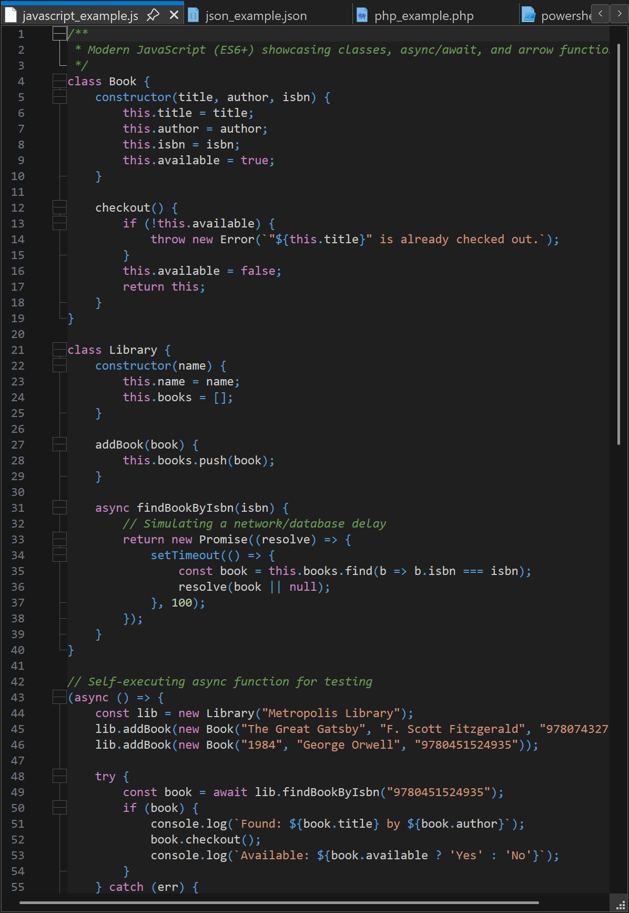

# Dark+ Modern Theme for Notepad++

A fresh, modern dark theme for Notepad++, crafted from scratch using the exact color palette of recent versions of VSCode (specifically **Dark+** and **Dark Modern**). 

*(Note: Due to differences in parser lexers, the highlighting is not a 1:1 replica of VS Code. Instead, it aims for consistency within the palette, prioritizing readability over absolute duplication.)* 

This project is a rebranding and complete overhaul of the previously **hellon8/VS2019-Dark-Npp** theme. We decided to keep it in this repository so existing users can easily discover and benefit from the new aesthetics!

> **Prefer the old VS2019-style theme?** It's still available on the [master branch](https://github.com/helldio/npp-Dark-Modern/tree/master).

*Note: This theme was originally inspired by and evolved from the works of [cydh's VS2015-Dark-Npp](https://github.com/cydh/VS2015-Dark-Npp) and [SeanCline's Npp-VS2012-Dark](https://github.com/SeanCline/Npp-VS2012-Dark). Thanks to their original efforts!*

## Screenshots

Check out the [Screenshots](screenshots/README.md) to see how the theme highlights different programming languages (including C, C++, C#, CSS, F#, HTML, Java, JavaScript, JSON, PHP, PowerShell, Python, Rust, SQL, XML, and YAML).

## Installation

The easiest way to install the theme is by cloning or downloading the repository and running the install script.

### Method 1: Automatic Script (Recommended)
1. Clone or download this repository.
2. Run `install.cmd`. It will automatically copy all files to the correct locations:
   - **Theme** → `%AppData%\Notepad++\themes\`
   - **Markdown UDL** → `%AppData%\Notepad++\userDefineLangs\`
   - **CSVLint plugin config** → `%AppData%\Notepad++\plugins\config\`

   Any missing directories are created automatically. Each step reports `[OK]` or `[FAILED]` so you can spot any issues at a glance.

### Method 2: Import
1. Download the [`Dark+ Modern.xml`](Dark%2B%20Modern.xml) file (or **Right Click** [`HERE`](https://raw.githubusercontent.com/helldio/npp-Dark-Modern/main/Dark%2B%20Modern.xml) and select **Save Link As...**).
2. Open Notepad++.
3. Go to **Settings > Import > Import Style Theme(s)...**
4. Select the downloaded `.xml` file.
5. Go to **Settings > Style Configurator**, select **Dark+ Modern** from the theme dropdown, and click **Save & Close**.

### Method 3: Manual Installation
1. Download [`Dark+ Modern.xml`](Dark%2B%20Modern.xml) (or **Right Click** [`HERE`](https://raw.githubusercontent.com/helldio/npp-Dark-Modern/main/Dark%2B%20Modern.xml) and select **Save Link As...**).
2. Copy the file to `%AppData%\Notepad++\themes`.
   - *Note: If you use a portable version, copy it to the `themes` folder in your Notepad++ installation directory.*
3. Restart Notepad++.
4. Select the theme in **Settings > Style Configurator**.

